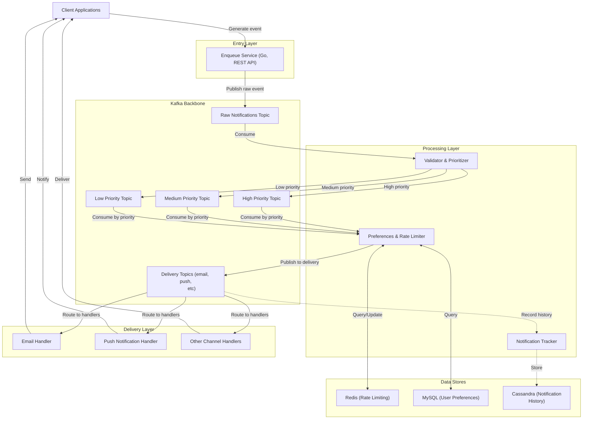
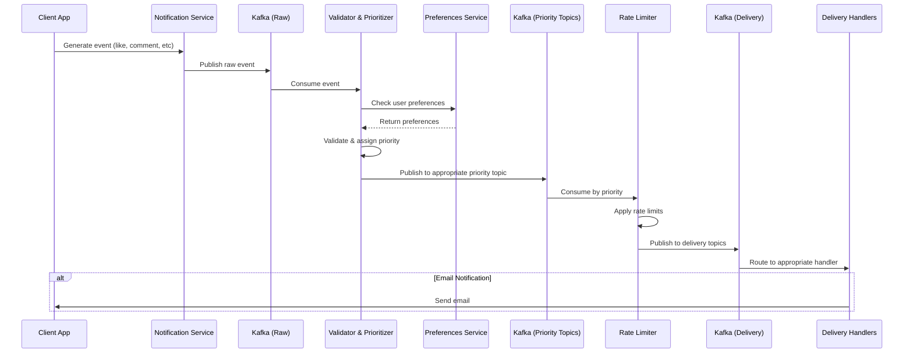
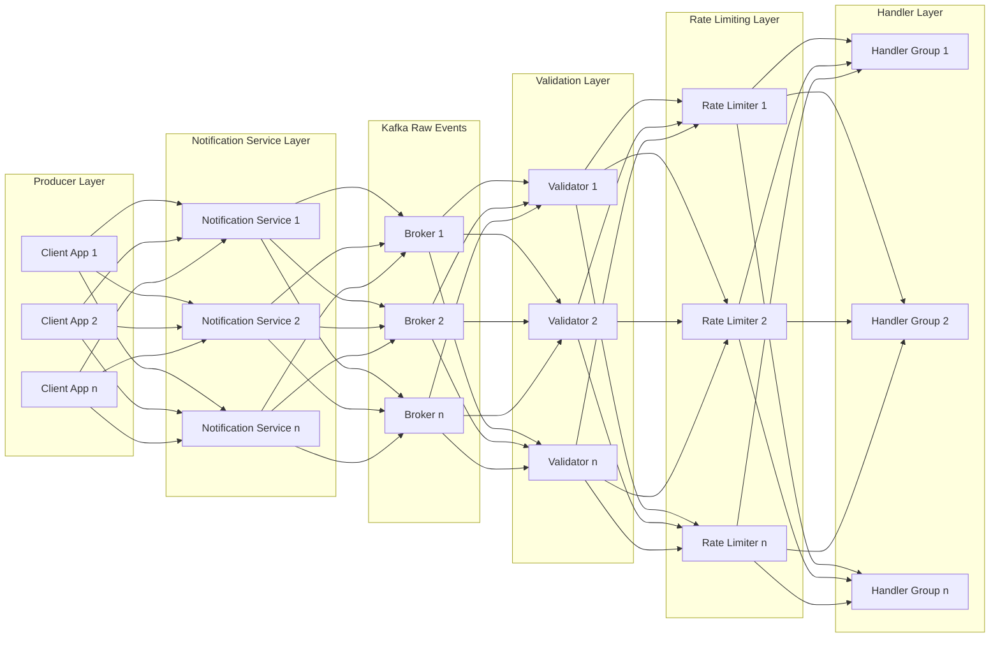

# Fully-Scalable De-coupled Notifications Service

A Conceptual highly scalable, loosely coupled distributed notification system designed for high throughput and reliability.

## System Overview

This project implements a minimal concept as to how notifications can be handled at scale. Built using a microservices architecture with event driven communication patterns, it handles reliable delivery across multiple channels with minimal coupling between components. 

For simplicity all the services are managed by a single `docker-compose` file, but in real-world scenario it can orchestrated using `kubernetes` or something.

## Architecture Diagram

## Key Features

- ✅ **Microservices Architecture**: Loosely coupled services; Kafka being the heart of the system

- ✅ **Priority-Based Processing**: Different processing lanes for different notification priorities
- ✅ **Rate Limiting**: Redis-backed rate limiting skeleton to prevent notification fatigue & possible DDoS attacks
- ✅ **Horizontal Scalability**: Each component can be independently scaled
- ✅ **Fault Tolerance**: Resilient design with enough redundancy to handle broker failures
- ✅ **Event Tracking**: Cassandra-backed notification history Skeleton for analytics and auditing

## Architecture Components

- __**Enqueue Service**__: Entry point for all notification requests. Validates and publishes events to Kafka.
- __**Notification Validator & Prioritizer Service**__: Consumes, validates, assigns priorities, and dispatches to appropriate topic.
- __**Rate Limiter Service**__: Controls notification flow and applies rate limiting.

- __**Notification Tracker (Future Plan)**__: Records notification history for analytics and auditing (SKELETON)
- **Data Stores**: 
  - **Redis**: For rate limiting
  - **MySQL**: For user preferences
  - **Cassandra**: For notification history (SKELETON)

## Data Flow

## Scaling Strategy

The system is designed to scale horizontally at each layer:

Each component can be independently scaled based on load patterns, with Kafka partitioning ensuring parallel processing.

## Design Decisions and Trade-offs

### Why Kafka?
Kafka for high-throughput, persistent event streaming needs. Its partitioning, consumer-groups and leader-follower paradigm opens up path to easy horizontal scaling and fault tolerance.

### Why Multiple Services?
Breaking the system into microservices allows for:
- Independent scaling based on load patterns
- Isolated failure domains
- Easy management and debugging

### Rate Limiting Strategy
Rate limiting can be implemented at multiple levels:
- Global system-wide limits
- Per-user limits
- Per-channel limits
- Priority-based limits

## Example Usage

- Spin up the services using `docker compose up` in /`infrastructure` directory. 
- Once the services are up, use example curl below.

`
curl -X POST http://localhost:8080/api/v1/notifications \
  -H "Content-Type: application/json" \
  -d '{
    "user_id": "user-001",
    "event_type": "security_alert",
    "content": "Suspicious login attempt detected from a new device",
    "metadata": {
      "device": "Unknown iPhone",
      "location": "Somewhere in the world",
      "ip_address": "203.0.113.42",
      "timestamp": '$(date +%s)'
    }
  }'
`
- Then use `docker exec -it kafka-1 kafka-console-consumer --bootstrap-server localhost:9092 --topic notifications.raw --from-beginning` to see the messages in the topic.
- You can also use `docker-compose -f notifications-service/infrastructure/docker-compose.yml logs -f [<service-name>]` to see the logs .

- If you see issues such as service exited during subsequent startup, make sure to remove old volumes using command such as `docker volume rm [<volume_name>]`.